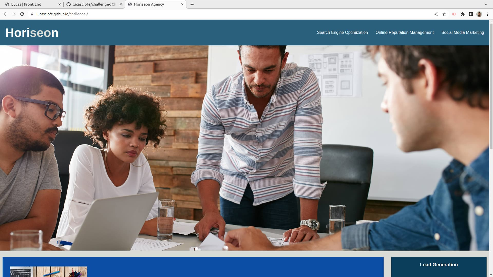

# Horiseon Agency 

## Description
This First Challenge was created for boot camp students who where going through the EDX front end development
course. It contains how to use the semantics elements in HTML for accessibility.

## Installation
N/A

## Usage

To see this web page above you can access through this link [Lucas's Github](lucasciofe.github.io/challenge-/).
This project discusses the importance of using the right semantic elements for accessibility
rather than using only the div element, it has a wide variety of elements to define such as
`header`, `main`, `section`, `article`, `aside` and etc.
You can see more the definition of each in [HTML Semantic Elements](https://www.w3schools.com/html/html5_semantic_elements.asp).

## Credits
N/A

## License
Mit license.

